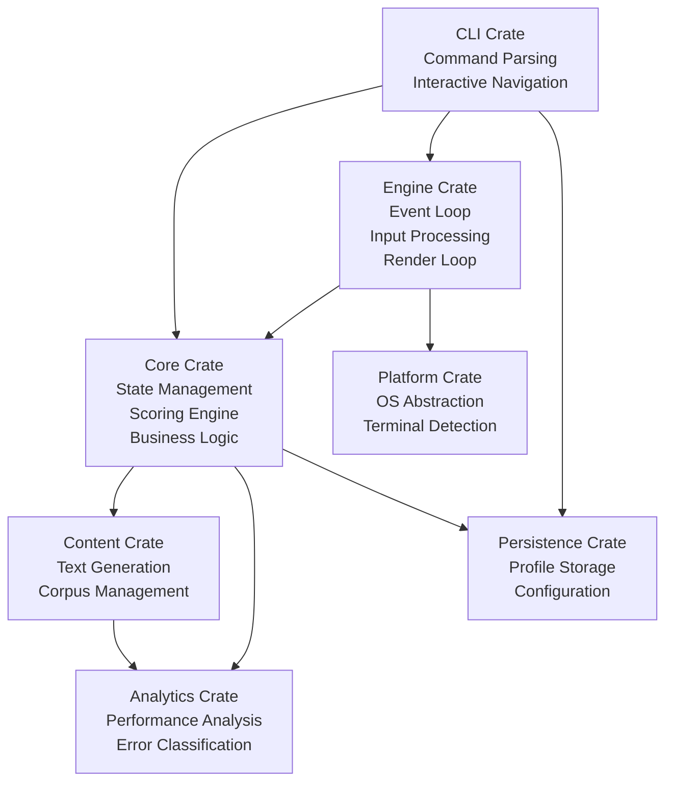
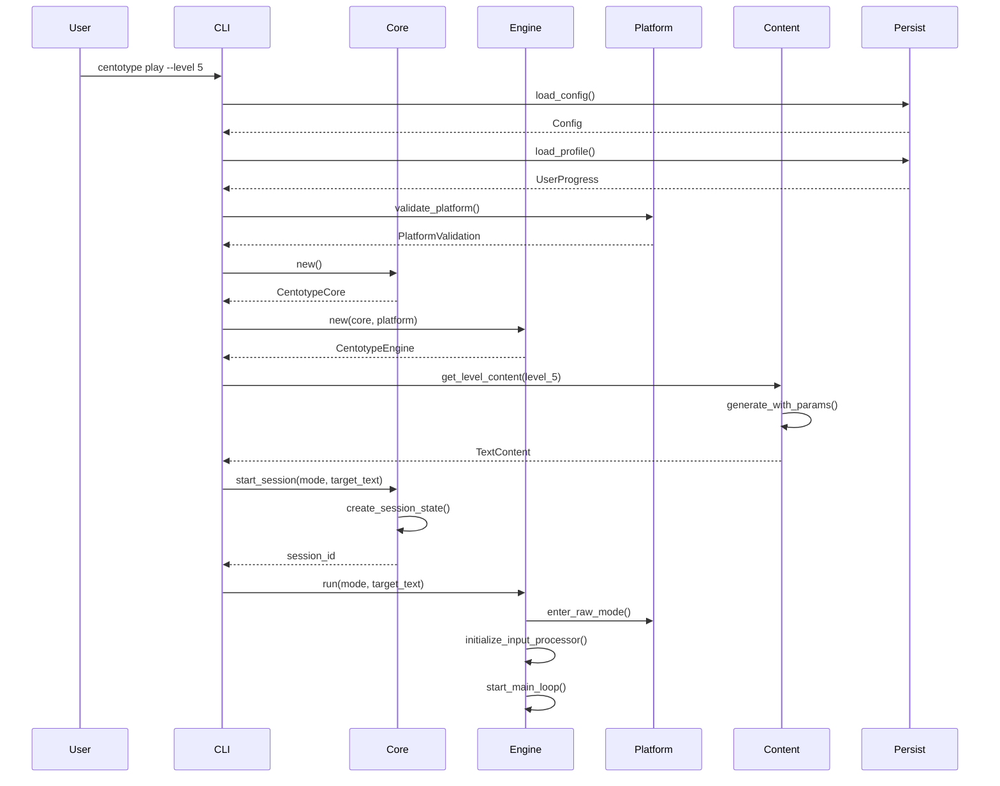
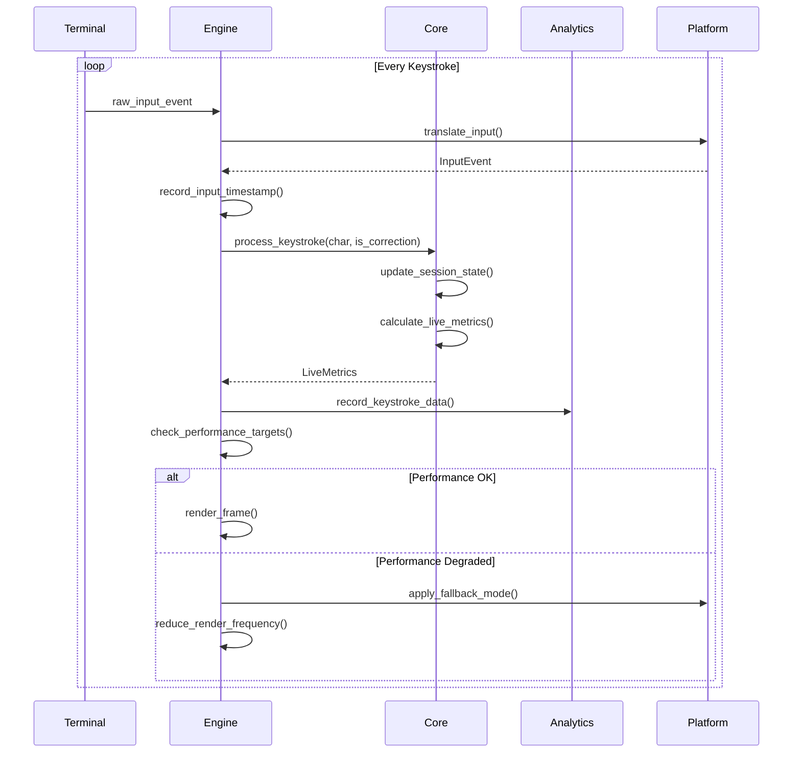
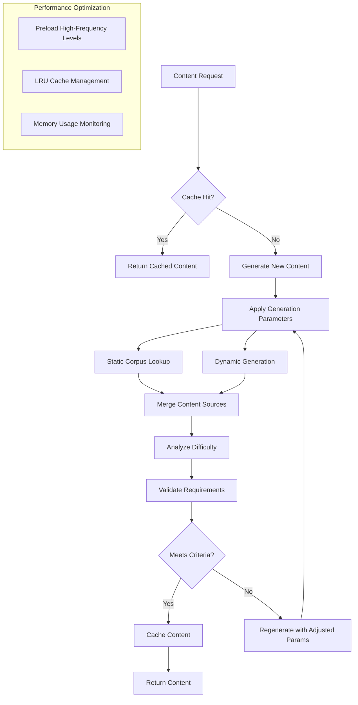
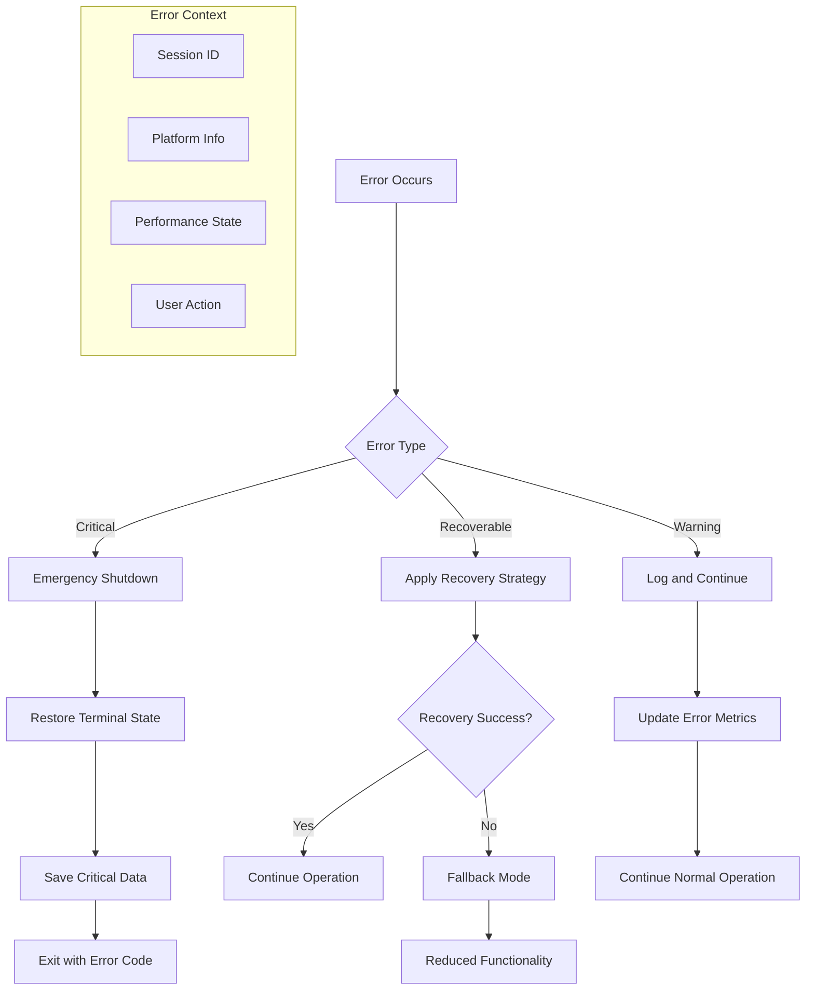

# Data Flow Architecture and Crate Interactions

## Overview

This document defines the complete data flow architecture for Centotype, showing how the 7 crates interact to deliver the typing trainer functionality while meeting performance targets.

## High-Level Architecture



## Detailed Data Flow Diagrams

### 1. Session Initialization Flow



### 2. Real-Time Input Processing Flow



### 3. Content Generation and Caching Flow



## Component Interface Specifications

### Core ↔ Engine Interface

**Core → Engine:**
```rust
// State updates pushed to engine for rendering
pub struct StateUpdateEvent {
    pub session_id: uuid::Uuid,
    pub typed_text: String,
    pub cursor_position: usize,
    pub live_metrics: LiveMetrics,
    pub timestamp: DateTime<Utc>,
}

// Performance monitoring data
pub struct PerformanceUpdate {
    pub input_latency: Duration,
    pub render_time: Duration,
    pub memory_usage: u64,
}
```

**Engine → Core:**
```rust
// Input events from engine to core
pub struct InputUpdate {
    pub char_typed: Option<char>,
    pub is_correction: bool,
    pub timestamp: DateTime<Utc>,
    pub input_latency: Duration,
}

// Session control commands
pub enum SessionCommand {
    Pause,
    Resume,
    Complete,
    Abort,
}
```

### Core ↔ Content Interface

**Core → Content:**
```rust
// Content request with requirements
pub struct ContentRequest {
    pub level: Option<LevelId>,
    pub category: ContentCategory,
    pub language: Language,
    pub target_duration: Duration,
    pub difficulty_range: (f64, f64),
    pub seed: Option<u64>, // For deterministic generation
}
```

**Content → Core:**
```rust
// Generated content with metadata
pub struct ContentResponse {
    pub content: TextContent,
    pub generation_time: Duration,
    pub difficulty_analysis: DifficultyScore,
    pub cache_key: String,
}
```

### Core ↔ Analytics Interface

**Core → Analytics:**
```rust
// Real-time performance data
pub struct PerformanceDataPoint {
    pub timestamp: DateTime<Utc>,
    pub wpm: f64,
    pub accuracy: f64,
    pub error_rate: f64,
    pub keystroke_interval: Duration,
}

// Session completion data
pub struct SessionAnalysisRequest {
    pub session_result: SessionResult,
    pub detailed_keystrokes: Vec<Keystroke>,
    pub performance_timeline: Vec<PerformanceDataPoint>,
}
```

**Analytics → Core:**
```rust
// Analysis results and recommendations
pub struct AnalysisResponse {
    pub overall_score: f64,
    pub improvement_areas: Vec<SkillArea>,
    pub consistency_rating: f64,
    pub recommended_practice: Vec<DrillCategory>,
}
```

### Engine ↔ Platform Interface

**Engine → Platform:**
```rust
// Platform capability requests
pub struct CapabilityRequest {
    pub required_features: Vec<PlatformFeature>,
    pub performance_targets: PerformanceTargets,
}

// Resource monitoring requests
pub struct ResourceMonitorRequest {
    pub monitor_memory: bool,
    pub monitor_cpu: bool,
    pub sample_interval: Duration,
}
```

**Platform → Engine:**
```rust
// Platform capability response
pub struct CapabilityResponse {
    pub supported_features: Vec<PlatformFeature>,
    pub limitations: Vec<String>,
    pub recommended_settings: PlatformSettings,
}

// Real-time resource metrics
pub struct ResourceMetrics {
    pub cpu_usage: f64,
    pub memory_rss: u64,
    pub memory_available: u64,
    pub timestamp: DateTime<Utc>,
}
```

## Performance-Critical Data Paths

### 1. Input Processing Path (Target: P99 < 25ms)

```rust
// Hot path optimization
impl InputProcessor {
    #[inline(always)]
    pub fn process_keystroke(&mut self, raw_input: RawInput) -> Result<ProcessedInput> {
        let start_time = Instant::now();

        // Minimal processing in hot path
        let processed = ProcessedInput {
            char_typed: raw_input.to_char(),
            timestamp: start_time,
            is_correction: raw_input.is_backspace(),
        };

        // Defer expensive operations to background thread
        self.background_queue.send(raw_input).ok();

        Ok(processed)
    }
}
```

### 2. Render Loop Path (Target: P95 < 33ms)

```rust
// Optimized render pipeline
impl Renderer {
    pub fn render_frame(&mut self, state: &RenderState) -> Result<()> {
        let frame_start = Instant::now();

        // Check if render is needed (dirty flags)
        if !self.needs_render(state) {
            return Ok(());
        }

        // Use double buffering for smooth updates
        let mut back_buffer = self.back_buffer.lock();
        self.render_to_buffer(&mut back_buffer, state)?;

        // Atomic buffer swap
        std::mem::swap(&mut self.front_buffer, &mut back_buffer);

        // Update performance metrics
        let render_time = frame_start.elapsed();
        self.record_render_time(render_time);

        Ok(())
    }
}
```

## Memory Management Strategy

### Memory Budget Allocation

```rust
// Memory usage targets (total < 50MB)
pub struct MemoryBudget {
    pub core_state: MemoryLimit,      // 5MB - session state, scoring
    pub engine_buffers: MemoryLimit,  // 10MB - input/render buffers
    pub content_cache: MemoryLimit,   // 20MB - text content cache
    pub analytics_data: MemoryLimit,  // 5MB - performance tracking
    pub platform_data: MemoryLimit,  // 5MB - platform abstractions
    pub misc_overhead: MemoryLimit,   // 5MB - allocator overhead, etc.
}

#[derive(Debug, Clone, Copy)]
pub struct MemoryLimit {
    pub soft_limit_mb: u64,
    pub hard_limit_mb: u64,
    pub current_usage_mb: u64,
}
```

### Cache Management

```rust
impl ContentCache {
    pub fn manage_memory(&mut self) {
        if self.memory_usage() > self.soft_limit {
            // LRU eviction for less critical content
            self.evict_lru_items(0.2); // Remove 20% of cache
        }

        if self.memory_usage() > self.hard_limit {
            // Aggressive cleanup
            self.evict_all_except_current_level();
        }
    }

    pub fn preload_strategy(&mut self, current_level: LevelId) {
        // Preload likely next levels
        let preload_levels = vec![
            current_level,
            LevelId::new(current_level.0 + 1).ok(),
            LevelId::new(current_level.0 - 1).ok(),
        ];

        for level in preload_levels.into_iter().flatten() {
            if !self.contains_level(level) && self.has_memory_budget() {
                self.background_load(level);
            }
        }
    }
}
```

## Error Propagation Patterns

### Error Flow Diagram



## Configuration and State Persistence

### State Synchronization

```rust
// Atomic state updates across components
pub struct StateTransaction {
    pub session_updates: Vec<SessionStateUpdate>,
    pub config_updates: Vec<ConfigUpdate>,
    pub performance_updates: Vec<PerformanceUpdate>,
    pub timestamp: DateTime<Utc>,
}

impl StateManager {
    pub fn apply_transaction(&mut self, transaction: StateTransaction) -> Result<()> {
        // Validate transaction consistency
        self.validate_transaction(&transaction)?;

        // Apply updates atomically
        let _lock = self.state_lock.write();

        for update in transaction.session_updates {
            self.apply_session_update(update)?;
        }

        for update in transaction.config_updates {
            self.apply_config_update(update)?;
        }

        // Commit timestamp
        self.last_update = transaction.timestamp;

        Ok(())
    }
}
```

## Testing and Validation Interfaces

### Performance Testing Hooks

```rust
#[cfg(test)]
pub mod testing {
    use super::*;

    pub struct PerformanceTestHarness {
        pub target_latency_ms: u64,
        pub target_throughput_hz: u64,
        pub max_memory_mb: u64,
    }

    impl PerformanceTestHarness {
        pub fn run_latency_test(&self, engine: &mut CentotypeEngine) -> TestResult {
            let mut latencies = Vec::new();

            for _ in 0..1000 {
                let start = Instant::now();
                let _ = engine.process_mock_input('a');
                latencies.push(start.elapsed());
            }

            latencies.sort();
            let p99 = latencies[(latencies.len() * 99) / 100];

            TestResult {
                p99_latency: p99,
                meets_target: p99.as_millis() <= self.target_latency_ms,
                sample_count: latencies.len(),
            }
        }

        pub fn run_memory_test(&self, duration: Duration) -> MemoryTestResult {
            // Implementation for memory usage testing
            unimplemented!()
        }
    }
}
```

This architecture ensures clear separation of concerns while maintaining high performance and robust error handling across all components.